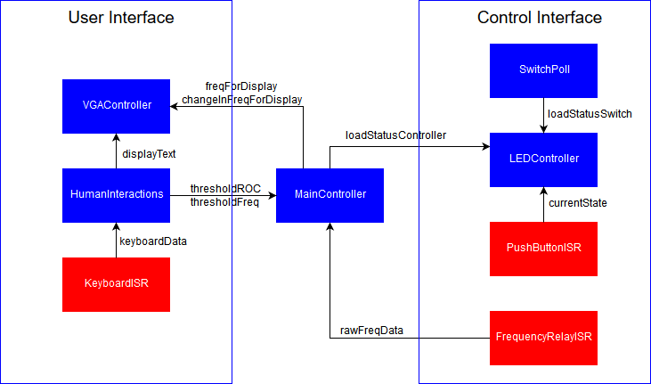

# Paper Plan for Assignment 1

*March 29, 2018 - Joshua Gudsell & Sakayan Sitsabesan*

## Block Diagram

## Use Case

A frequency value lower than the threshold is read by the frequency analyser. The system was in the stable state prior to this event and has been monitoring the frequency (i.e. not in maintenance mode).
After 20 milliseconds, a new frequency reading above the threshold is read.

*Our steps to respond to this change are as follows:*

1. The FrequencyRelayISR will read the frequency and pass on the value to the MainController and set the freqRelaySemaphore to trigger the MainController.
2. This will cause the MainController FSM to move into the shed load state and remove one of the loads.
3. The MainController FSM will then move into the monitor state, the timeout timer will be started.
4. The MainController FSM will stay in the monitoring state.
5. The MainController FSM will then detect the new frequency as above the threshold and will reset the timeout timer due to a change in the frequency.
7. The MainController will stay in the monitoring state until the timeoutCallback function is called which will trigger the MainController to move into the reconnectLoad state using the timeoutFinish global variable.

## Tasks

* VGAController (Priority 1)
    * Description: This task will read the data coming from the other tasks/ISRs and display the necessary information in an appropriate format (graphical/textual) on the VGA Display.
    * Condition: TaskDelay every 40ms
    * Queues read: freqForDisplay, changeInFreqForDisplay
    * Variables read: displayText
* MainController (Priority 3)
    * Description: This is the central controller task that makes the major logic decisions in this program, more details can be found in FSM diagram below.
    * Condition: Wait on freqRelaySemaphore
    * Queues read: rawFreqData
    * Queues written: freqForDisplay, changeInFreqForDisplay
    * Variables read: thresholdROC, timeoutFinish
    * Variables written: loadStatusController
* HumanInteractions (Priority 1)
    * Description: Controls all interactions with the computer via keyboard/screen. Calculates and stores new threshold values based on these interactions.
    * Condition: Wait on keyboardSemaphore
    * Queues read: keyboardData
    * Variables written: thresholdFreq, thresholdROC, displayText
* LEDController (Priority 2)
    * Description: Calculates the current status of the loads and sets the LEDs appropriately. In normal mode will read from two variables coming from the controller and switches while in maintenance mode will only read from the switches.
    * Condition: TaskDelay every 10ms
    * Variables read: currentState, loadStatusSwitch, loadStatusController
* SwitchPoll (Priority 2)
    * Description: Polls the switches and writes their current status to a global variable
    * Condition: TaskDelay every 10ms
    * Variables written: loadStatusSwitch

## ISR

* KeyboardISR
    * Description: Reads and records the key presses registered on the PS/2 keyboard.
    * Condition: Interrupt on keyboard event
    * Queues written: keyboardData
    * Sets keyboardSemaphore
* PushButtonISR
    * Description: Reads the events occurring on the push buttons and passes on appropriate messages to the appropriate task to initiate the associated task. 
    * Condition: Interrupt on push button event
    * Variables written: currentState
* FrequencyRelayISR
    * Description: Reads the frequency from the hardware component 
    * Condition: Interrupt on hardware trigger event
    * Queues written: rawFreqData
    * Sets freqRelaySemaphore

## Global Variables

* currentState - bool
    * True => in maintenance mode
    * False => not in maintenance mode
* displayText - string
    * Contains misc other text that should be printed on the screen
* loadStatusSwitch - uint8_t
    * bits 1 - 5 represent the current status of each load as input by the user via switches
    * 0 => Load disconnected
    * 1 => Load connected
* loadStatusController - uint8_t
    * bits 1 - 5 represent the current status of each load as desired by the controller
    * 0 => Load disconnected
    * 1 => Load connected
* thresholdROC - uint8_t
    * Stores the value of the currently set Rate of Change threshold
* thresholdFreq - uint8_t
    * Stores the value of the currently set frequency threshold
* timeoutFinish - bool
    * True - timeout of 500ms has been completed without any resets
    * False - timeout yet to be completed
## Queues

* freqForDisplay
     * list of values for displaying by the VGA controller
* changeInFreqForDisplay
    * list of values for displaying by the VGA controller
* rawFreqData
    * list of values coming from hardware component
* keyboardData
    * list of ASCII codes for the key presses occurring

## Semaphores

* keyboardSemaphore
* freqRelaySemaphore

## Timer Callback Function

* timeoutCallback
    * Description: Sets timeoutFinish variable and also sets freqRelaySemaphore
    * Condition: Callback function after 500ms have timed out from when system became stable/unstable

## FSM Diagram

